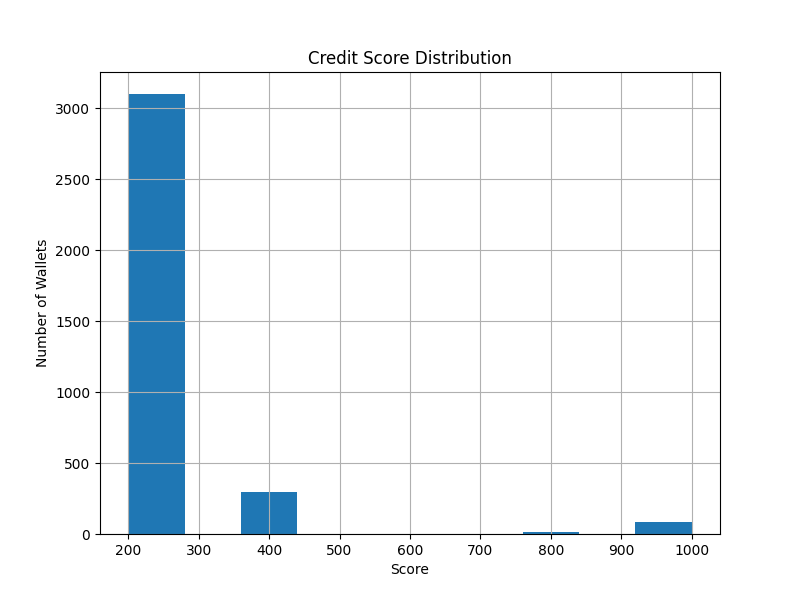

# Wallet Score Distribution & Behavior Analysis

## 🔢 Score Ranges
- 0–100
- 100–200
- ...
- 900–1000

## 📊 Distribution Plot

## 🧠 Interpretation

### 🟥 0–200 (Very Low Scores)
- High number of liquidations
- Rarely repaid loans
- Often bot-like or inactive

### 🟧 300–500 (Moderate Risk)
- Mixed borrow and repay behavior
- Minor liquidations
- Average reliability

### 🟩 600–800 (Reliable Users)
- Consistent deposits & repayments
- Rare liquidation
- Good DeFi citizens
